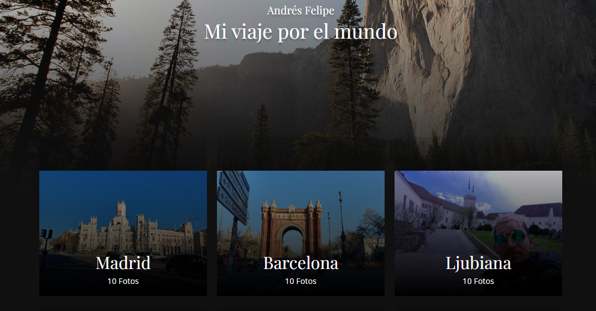
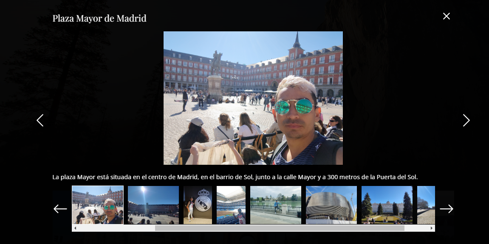

# Galeria Mi viaje por el mundo 🗺️🧭🌏

Explora mi viaje por el mundo en una galería única, donde JavaScript, HTML, SCSS y CSS se unen para crear una experiencia visualmente impactante.

Descubre el mundo a través de mis ojos: una galería visual de mi increíble viaje por el mundo. Sumérgete en paisajes exóticos, culturas vibrantes y experiencias inolvidables capturadas en cada imagen. ¡Explora, sueña y viaja conmigo en esta emocionante galería.

## Capturas de Pantalla 📷📷

- Página principal.

- Galeria

## Características

- Diseño moderno y atractivo.
- Información detallada sobre la foto, lugar y la descripción.
- Galería de imágenes interactiva y de fácil manejo.
- Enlace a mis redes sociales y laborales.

## Tecnologías Utilizadas 💻💻

- JavaScript
76.6%
 
- HTML
10.3%
 
- SCSS
6.7%
 
- CSS
6.4%

## Licencia

Este proyecto está bajo la Licencia MIT. Consulta el archivo [LICENSE](LICENSE) para más detalles.

